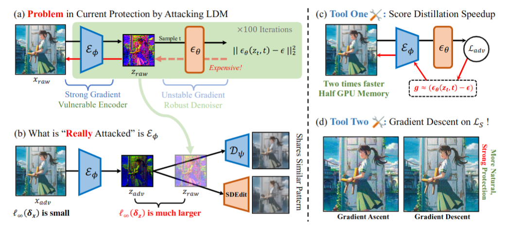

<div align="center">

<h2>Toward effective protection against diffusion-based mimicry through score distillation</h2>

Project lead by **[Haotian Xue](https://xavihart.github.io/)** from GaTech, advised by  **[Yongxin Chen](https://xavihart.github.io/)**.

This work is along the same line with Mist [https://mist-documentation.readthedocs.io/], thanks for the support of Xiaoyu Wu and Chumeng Liang from the Mist team.


</div>





TL;DR : a more effective protection against malicious diffusion model editing, faster speed, lower GPU occupation

## Quick Setup

Install the envs:

```
conda env create -f env.yml
conda activate mist
pip install --force-reinstall pillow
```

Download the checkpoint of LDM [Stable-diffusion-model v1.4 checkpoint]

```
wget -c https://huggingface.co/CompVis/stable-diffusion-v-1-4-original/resolve/main/sd-v1-4.ckpt

mv sd-v1-4.ckpt ckpt/model.ckpt
```


## Run the Protection 

Configs can be set in `configs/attack/base.yaml`, some keys arguments include:

```
attack:
    epsilon: 16 # l_inf budget
    steps: 100 # attack steps
    input_size: 512 # image size
    mode: sds 
    img_path: [IMAGE_DIR_PATH]
    output_path: [OUT_PATH]
    alpha: 1 # step size
    g_mode: "+"
    use_wandb: False
    project_name: iclr_mist
    diff_pgd: [False, 0.2, 'ddim100'] # un-used feature
    using_target: False
    target_rate: 5 # scale factor for L_S and L_T
    device: 0 # GPU id

```


here we offer some scripts to run different type of protections:

AdvDM:
```
python code/diff_mist.py attack.mode='advdm' attack.g_mode='+'
```
PhotoGuard:
```
python code/diff_mist.py attack.mode='texture_only' attack.g_mode='+'
```

Mist:
```
python code/diff_mist.py attack.mode='mist' attack.g_mode='+'
```
AdvDM(-):
```
python code/diff_mist.py attack.mode='advdm' attack.g_mode='-'
```
SDS(+):
```
python code/diff_mist.py attack.mode='sds' attack.g_mode='+'
```
SDS(-):
```
python code/diff_mist.py attack.mode='sds' attack.g_mode='-'
```
SDST(-):
```
python code/diff_mist.py attack.mode='sds' attack.g_mode='-' attack.using_target=True
```

the output includes: `[NAME]_attacked.png` which is the attacked image, `[NAME]_multistep.png` which is the SDEdit results, and `[NAME]_onestep.png` which is the onestep x_0 prediction results.


